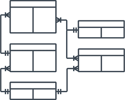

# Database

## Table of Contents
1. [Postgres](#postgres)
2. [SQL](#sql)
    1. [Indexes](#indexes)
    2. [Between](#between)
    3. [Coalesce](#coalesce)

## Postgres
### Operators
* Contains
```sql
@>
```
* jsonb
```postgres
-->
-> 
```
### PostGIS


## SQL
### Entity Relationship Model
Composed of entity types and specifies relationships that can exist between instances of those entity types.
* Show relationships
* Business process
* Visual representation
* Show links (primary keys)



### Primary Key
* A column (or set of columns) whose values uniquely identify every row in the table.

### Foreign Key
* One or more columns that can be used together to identify a single row in another table.

### Indexes
* Concurrent Indexing 
Creating an index can interfere with regular operation of a database. 
`CONCURRENTLY` option of `CREATE INDEX`.
* GIN
Best for static data, 3 times faster than GiST, takes 3 times longer to build than GiST

### Temporary Tables
```sql
CREATE TEMPORARY TABLE Actives AS
(
  SELECT *
  FROM properties
  WHERE status = 'active'
)
```

### Comments
* Single Line
```sql
SELECT property_id
--,type_of_dwelling
,full_address
FROM listings 
```
* Section
```sql
SELECT property_id
/*,type_of_dwelling
,full_address
*/
FROM listings
```

### Operations
* Explain
    ```sql
    EXPLAIN(ANALYZE, COSTS, VERBOSE, BUFFERS)
    ```
* Between
    ```sql
    BETWEEN
    ```
* Coalesce
    ```sql
    COALESCE
    ```
* Union: combines the result sets of two queries.
    ```sql
    UNION
    ```

### Matchers
`ILIKE` allows matching of strings based on comparison with a pattern (case-insensitive)
